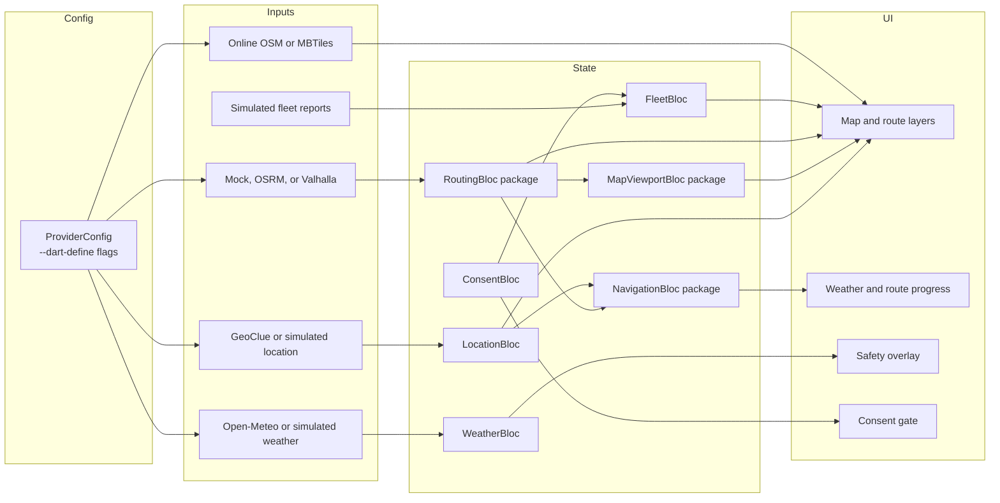
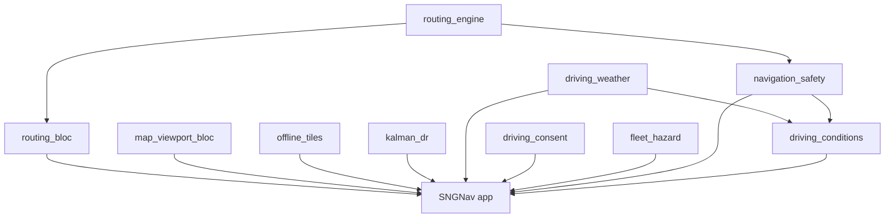

# SNGNav Architecture Overview

SNGNav is an offline-first Flutter navigation stack for embedded Linux. It is
built to keep the navigation display useful when real conditions degrade:
network loss, GPS interruptions, unexpected snow, and uneven target hardware.

This document is the map for developers arriving at the repo for the first
time. It explains how the application is split across packages, where the main
runtime entrypoints live, and how data moves from providers through BLoCs into
the UI.

## At A Glance

| Layer | Purpose | Main paths |
|-------|---------|------------|
| App shell | Demo entrypoints and composition root | `lib/main.dart`, `lib/snow_scene.dart`, `lib/demo_*.dart` |
| App-local state | Consent, location, fleet, and weather wiring | `lib/bloc/`, `lib/config/`, `lib/providers/`, `lib/services/` |
| UI surfaces | Map, navigation, safety, and consent widgets | `lib/widgets/` |
| Extracted packages | Reusable navigation building blocks | `packages/*/` |
| Deployment docs | Bring-up and local routing guides | `docs/local_routing.md`, `docs/arm_deployment.md` |

## Runtime Shape

The minimal path is `lib/main.dart`: an offline map demo that proves MBTiles
loading and online fallback. The full application path is `lib/snow_scene.dart`:
that entrypoint wires the providers, BLoCs, route engine, and safety overlays.

## Entry Points

| File | When to run it | What it proves |
|------|----------------|----------------|
| `lib/main.dart` | Fastest first run | Flutter Linux + `offline_tiles` package + MBTiles fallback logic |
| `lib/snow_scene.dart` | Main product demo | Full navigation stack with weather, safety, routing, and consent |
| `lib/demo_routing.dart` | Routing-focused work | Routing engine behavior in isolation |
| `lib/demo_weather.dart` | Weather-focused work | Weather provider integration and hazard display |
| `lib/demo_navigation.dart` | Navigation UX work | Turn-by-turn and route progress surfaces |
| `lib/demo_map.dart` | Map-focused work | Map viewport and layer behavior |

## Provider Configuration

`lib/config/provider_config.dart` is the runtime switchboard. It keeps the
application implementation-agnostic by selecting concrete providers through
`--dart-define` flags instead of code edits.

Supported flags:

| Flag | Default | Purpose |
|------|---------|---------|
| `WEATHER_PROVIDER` | `open_meteo` | Real or simulated weather |
| `LOCATION_PROVIDER` | `simulated` | Simulated trace or GeoClue GPS |
| `ROUTING_ENGINE` | `valhalla` | Mock, OSRM, or Valhalla routing |
| `VALHALLA_BASE_URL` | empty | Override the Valhalla endpoint |
| `DEAD_RECKONING` | `true` | Enable or disable DR wrapping |
| `DR_MODE` | `kalman` | Kalman or linear dead reckoning |
| `TILE_SOURCE` | `online` | Online OSM or MBTiles |
| `MBTILES_PATH` | `data/offline_tiles.mbtiles` | Offline tile archive path |

This is why the same repo can run as a minimal desktop demo, a fully offline
mock scenario, or a Linux target backed by local routing services.

## BLoC Composition

SNGNav's main scene wires seven BLoCs. Four are app-local, three come from
extracted packages.

### App-Local BLoCs

| BLoC | Responsibility | Main inputs |
|------|----------------|-------------|
| `LocationBloc` | Current position, movement updates, GPS quality | GeoClue or simulated location provider, dead reckoning wrapper |
| `WeatherBloc` | Weather polling, scenario phases, hazard state | Open-Meteo or simulated weather provider |
| `ConsentBloc` | Fleet consent state and persistence | SQLite-backed consent database |
| `FleetBloc` | Fleet markers and hazard reports | Simulated fleet provider, consent state |

### Package-Provided BLoCs

| Package | Responsibility |
|---------|----------------|
| `routing_bloc` | Fetch route, expose route state, switch engine implementations |
| `navigation_safety` | Turn-by-turn session state, route deviation, safety alert orchestration |
| `map_viewport_bloc` | Camera framing, route-fit behavior, layer visibility |

The split matters: extracted packages contain reusable logic, while the app's
`lib/` directory handles composition, target-specific providers, and demo
orchestration.

## Package Portfolio

The repo now exposes ten packages. They fall into three groups.

### Domain Foundations

| Package | Role | Depends on |
|---------|------|------------|
| `kalman_dr` | Dead reckoning and position smoothing | `equatable` |
| `driving_weather` | Weather models and provider interfaces | `http`, `equatable` |
| `driving_consent` | Consent-domain models and policies | `equatable` |
| `routing_engine` | Engine-agnostic routing models and clients | `http`, `latlong2`, `equatable` |
| `fleet_hazard` | Fleet-reported hazard models | `latlong2`, `equatable` |

### Flutter State Packages

| Package | Role | Depends on |
|---------|------|------------|
| `routing_bloc` | Routing state management for Flutter | `routing_engine`, `flutter_bloc`, `latlong2` |
| `map_viewport_bloc` | Viewport control and route-fit logic | `flutter_bloc`, `latlong2` |
| `navigation_safety` | Navigation flow and safety alerting | `routing_engine`, `flutter_bloc`, `latlong2` |

### Experience Packages

| Package | Role | Depends on |
|---------|------|------------|
| `offline_tiles` | MBTiles-backed map tiles for Flutter | `flutter_map`, `flutter_map_mbtiles`, `sqflite` |
| `driving_conditions` | Weather + safety composition for driving conditions | `driving_weather`, `navigation_safety`, `equatable` |

### Package Graph

This graph is intentionally asymmetric: some packages are app-agnostic domain
primitives, and others are Flutter adapters layered above them.

## The Five Guardians In Code

The README names five guardians. In the codebase, they map to concrete modules.

| Guardian | Failure mode | Main code |
|----------|--------------|-----------|
| Dead reckoning | GPS dropout in tunnels or urban canyons | `kalman_dr`, `LocationBloc`, `simulated_location_provider.dart` |
| Offline tiles | Network loss for map rendering | `offline_tiles`, `lib/main.dart`, `snow_scene.dart` |
| Local routing | Cloud unavailability | `routing_engine`, `routing_bloc`, `docs/local_routing.md` |
| Kalman filter | Noisy or degraded sensor input | `kalman_dr`, `ProviderConfig.drMode` |
| Config system | Different deployment targets and demos | `lib/config/provider_config.dart` |

That mapping is the architecture's core claim: each major failure mode is tied
to a specific subsystem, not treated as a generic future concern.

## Main Scene Wiring

`lib/snow_scene.dart` is the composition root for the full product demo.

It does five important things:

1. Opens the persistent SQLite consent database.
2. Reads runtime flags through `ProviderConfig.fromEnvironment()`.
3. Creates the optional MBTiles-backed tile provider.
4. Selects the routing engine (`mock`, `osrm`, or `valhalla`).
5. Wires the seven BLoCs into `SnowSceneScaffold`.

The file also contains the demo route and maneuver list used by the mock
routing engine. Those coordinates are intentionally aligned with the simulated
location provider and route shape so the weather corridor, maneuvers, and route
progress stay consistent.

## How To Read The Repo

Recommended order for a first technical pass:

1. Read `README.md` for the product boundary and quick start.
2. Run `lib/main.dart` to verify Flutter Linux and offline tiles.
3. Read `lib/config/provider_config.dart` to understand the runtime switches.
4. Run `lib/snow_scene.dart` with the mock profile from the README.
5. Inspect `packages/routing_engine`, `packages/routing_bloc`, and `packages/navigation_safety` in that order.
6. Read `docs/local_routing.md` and `docs/arm_deployment.md` when moving from desktop to embedded targets.

## Where To Go Next

- For local routing engines, see `docs/local_routing.md`.
- For Raspberry Pi and other arm64 Linux targets, see `docs/arm_deployment.md`.
- For contribution flow, see `CONTRIBUTING.md`.
