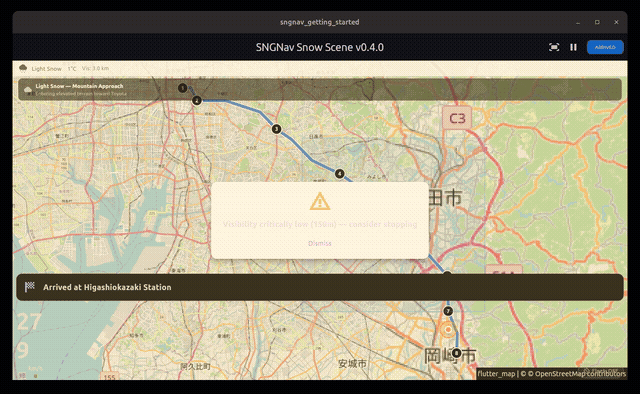
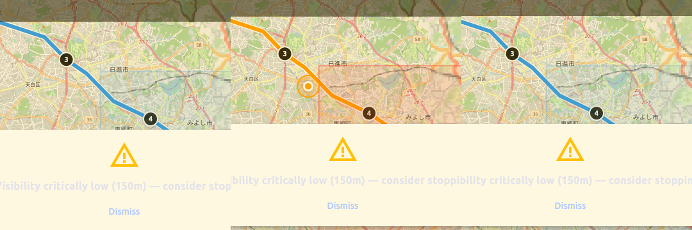
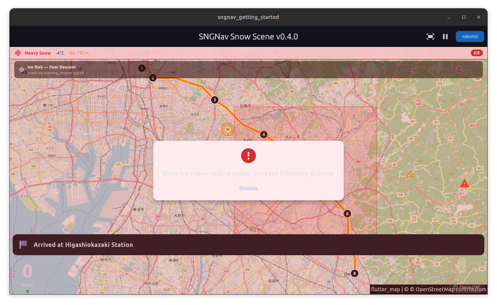

# Watch a Flutter map keep navigating when GPS and the network die — offline-first building blocks for embedded Linux

> **Honest scope.** The demo below is a real Flutter app, captured running on desktop Linux (software-rendered). The packages target embedded Linux head units (via [flutter-elinux](https://github.com/sony/flutter-elinux)); an on-target ARM build is a separate effort, not shown here. Every claim is bounded to what the recording actually shows.

*(Full clip: [`demo.mp4`](screenshots/demo.mp4) — 62 s.)*

## The problem nobody designs for

Most navigation code quietly assumes three things that fail exactly when a driver needs the map most:

1. **GPS is always there.** It isn't — tunnels, urban canyons, parking structures, dense forest drop the fix for seconds to minutes.
2. **The network is always there.** It isn't — rural roads, mountain passes, and the snowstorm where you most need a map are where cellular dies.
3. **The driver can see.** In a whiteout, they can't.

If you build for embedded automotive Linux (an IVI head unit, a fleet device, a Yocto image on an ARM SBC) you eventually hit a requirement desktop and phone apps get to ignore: *keep navigating when GPS, the network, and visibility all degrade at once.* That compound-failure case is the design target — and the demo above is exactly it, in two scenes, built from four small `pub add`-able packages.

## Scene 1 — keep moving after the GPS drops (fully offline)

The first half of the clip runs **with no network and no live GPS** — simulated location, map tiles from a local MBTiles file. The simulated drive enters a tunnel (~9–15 s into the loop) where the GPS fix goes silent.

Watch the **position marker**: blue while it has a fix, then **amber while it's dead-reckoning** through the tunnel — [`kalman_dr`](https://pub.dev/packages/kalman_dr) keeps estimating position from the last heading and speed with a Kalman filter, and the marker's colour reports that its accuracy has degraded past the trustworthy threshold. When the route exits the tunnel and GPS resumes, the marker snaps **back to blue**.

Two design choices make this usable in a safety context rather than a toy:

- **Honest degradation, shown.** The marker doesn't pretend it still has a fix — its colour changes the moment the estimate stops being trustworthy. (The on-screen signal here is colour; there's no separate "GPS lost" label.)
- **A safety cap.** Past a configured un-corrected distance, `kalman_dr` stops claiming a position entirely and surfaces "position unavailable" rather than lying to the driver. **68 unit tests** cover the tunnel-entry, degradation, recovery, multi-cycle, and cap cases.

The map itself is [`offline_tiles`](https://pub.dev/packages/offline_tiles) — a `TileProvider` for [`flutter_map`](https://pub.dev/packages/flutter_map) that serves tiles from a local `.mbtiles` file with zero network (resolver order: cache → MBTiles → lower zoom → online if available → placeholder, so the map never blanks). The clip is rendering a 1.8 MB regional MBTiles in airplane mode. (**51 tests pass.**)

## Scene 2 — warn about the road ahead from live open data (online)

Offline keeps you *oriented*. It doesn't tell you the road ahead is sheet ice. The second half of the clip switches to live data: the whole map takes a **red severe-condition tint** and a **hazard alert** appears.

That's driven by [`condition_aggregator_digitraffic`](https://pub.dev/packages/condition_aggregator_digitraffic) (v0.0.4) reading [Fintraffic's Digitraffic](https://www.digitraffic.fi/) open road data (Finland, **CC-BY 4.0**) and turning the raw CAP-style messages into a typed `Advisory` stream, which a small provider in [`driving_weather`](https://pub.dev/packages/driving_weather) maps onto the safety overlay.

**Two honest boundaries** on this scene:

- The weather bar ("Snow / −4 °C / Vis 150 m / ICE") shows *representative values keyed to the advisory's severity class* — the **severity is live** (a real severe-class Digitraffic advisory), the specific numbers are bucketed presentation, not measured weather.
- This scene needs the network — it's the *complement* to Scene 1, not part of the offline story.

There's a real bug-fix story underneath it. Finland's all-country feed isn't a fixed size (it tracks active-announcement count and geometries — measured from ~3.5 MB to ~16.4 MB within days). The v0.0.2/v0.0.3 adapter applied a *hard* 8 MB cap that **threw** on a valid large response, so on a busy winter day the advisory silently never arrived. **v0.0.4** removes the hard throw — it always parses a valid 200, with a soft 32 MB warn threshold and an optional diagnostic instead. The demo's advisory reached the UI on a live ~16.4 MB body; **22 unit tests** (including the large-response regression cases) cover the robustness the single live poll can't. If you fetch live national road data, this class of size-cap bug is worth checking for in your own adapters.

## Why these are separate packages

| Package | One job | pub.dev | tests |
|---|---|---|---|
| `kalman_dr` | dead-reckon through GPS loss, honestly | 0.4.0 | 68 |
| `offline_tiles` | render `flutter_map` tiles from local MBTiles, no network | 0.5.1 | 51 |
| `driving_weather` | a weather/advisory `Stream` your UI can react to | 0.4.0 | 45 |
| `condition_aggregator_digitraffic` | turn Finnish open road data into typed advisories | 0.0.4 | 22 |

Each does one thing and is independently useful. Take the dead-reckoning provider into your own `flutter_map` app and ignore everything else — that's the point.

## On embedded Linux

These are written for embedded Linux head units via [flutter-elinux](https://github.com/sony/flutter-elinux); the offline-first design (local tiles, dead reckoning, open-data advisories) exists precisely for the constrained, intermittently-connected automotive context. The demo above is desktop Linux; the on-target ARM head-unit build is a separate effort and, when it's verified on hardware, will be its own write-up rather than an unproven claim here.

## Try it

- Repo: https://github.com/aki1770-del/SNGNav
- Packages on pub.dev: [`kalman_dr`](https://pub.dev/packages/kalman_dr), [`offline_tiles`](https://pub.dev/packages/offline_tiles), [`driving_weather`](https://pub.dev/packages/driving_weather), [`condition_aggregator_digitraffic`](https://pub.dev/packages/condition_aggregator_digitraffic).
- If you're solving the GPS-dropout, offline-map, or live-road-condition problem on embedded Flutter and hit a wall, open an issue — that's the kind of road this is built for.

---

*Built as open-source building blocks for driver-assisting navigation that has to keep working when the infrastructure doesn't. Finnish road data © Fintraffic, [CC-BY 4.0](https://creativecommons.org/licenses/by/4.0/).*
