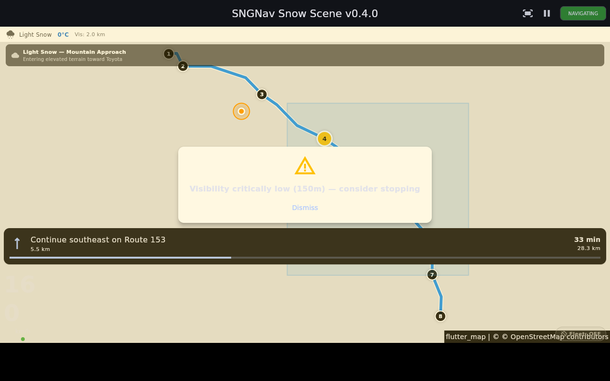

# Evidence: Snow Scene rendered on genuine aarch64

The SNGNav Snow Scene (`lib/snow_scene.dart`), rendered on a **genuine aarch64
Linux host** — not x86 emulating ARM. The frame shows the navigating state on a
mountain approach: the live weather strip (Light Snow, 0 °C, visibility 2.0 km),
the route polyline with waypoints over a flutter_map / OpenStreetMap base, the
current-position marker, the low-visibility advisory ("Visibility critically low
(150 m) — consider stopping"), and the turn-by-turn banner.

## How it was produced (reproducible)

- **Host**: GitHub-hosted `ubuntu-24.04-arm` runner — confirmed `uname -m: aarch64`,
  `Architecture: aarch64`. Real ARM silicon, not QEMU emulation.
- **Build**: native arm64 host build — `flutter build linux --release -t
  lib/snow_scene.dart` produced `build/linux/arm64/release/bundle/`. All native
  dependencies (GTK, SQLite, plugins) compiled for arm64.
- **Render**: headless via `Xvfb` with software rendering
  (`--enable-software-rendering`, `LIBGL_ALWAYS_SOFTWARE=1` / Mesa llvmpipe),
  captured with `scrot`.
- **Profile**: simulated weather + simulated location + mock routing (offline,
  no network or GPS dependency), exercising the full UI stack.
- **Workflow**: `.github/workflows/arm64_scene_render.yml`. CI run `27457030735`.

## Honest scope (what this does and does not prove)

- **Does prove**: the application builds and renders correctly on a genuine
  aarch64 Linux target, with all native dependencies compiling for ARM — a real
  step beyond emulation.
- **Does NOT prove**: performance on a physical in-vehicle (IVI) board with a
  real GPU. This host is a **server-class aarch64 CPU using software GL**, not a
  GPU. Frame rate and GPU-path behaviour on real embedded silicon remain open.

This is a stand-in rung toward running on real in-vehicle hardware — one honest
step above emulation, and not a substitute for proving it on the target board.

## Known cosmetic items in this capture

- A faint low-opacity heads-up element renders in the lower-left.
- The low-visibility advisory text is low-contrast against its panel.
- The map base renders pale under software GL (theme and/or partial tile load);
  the route, waypoints, and overlays render crisply.
