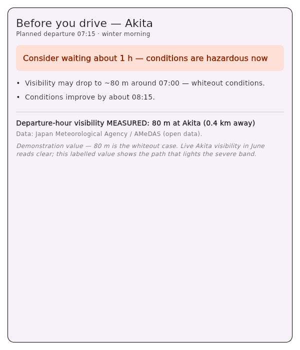

# Brief HER before the whiteout — in about 10 minutes

She left under a clear forecast. Halfway up the mountain pass the snow comes in
unexpected — visibility folds to a few car-lengths, and the dry asphalt she
trusted is turning to black ice. She is at the wheel: not a passenger of the
software, the one *reading the road*. What she needs is honest information that
serves **her** judgment, **offline** (the connection drops in the storm), and —
for HER mother in rural Akita — **in Japanese**.

This is a step-by-step on-ramp for the **edge developer** who builds that
pre-trip "before you drive" surface. You start from an empty `flutter create`
and finish with a working, **offline** briefing, assembled from published
packages plus **your own** UI. `pretrip_source_met_norway` is the honest
**global forecast source** you feed into the decision: it fetches MET Norway's
worldwide hourly forecast and maps it to the source-neutral
[`pretrip_decision_advisor`](https://pub.dev/packages/pretrip_decision_advisor)
contract.

The chain this serves: **we** serve the **edge developer** (you) → who builds
HER pre-trip safety surface → so **she** drives safely → which protects **her
family**.

What you'll have at the end is the briefing card below — the verdict, the
plain-language safety reasons, and (when you pair a measured source) the real
measured visibility:



> **About this picture (read it honestly):** it is a real, rendered, *looked-at*
> capture from the sibling worked example
> [`examples/edge_dev_akita_briefing/`](../../examples/edge_dev_akita_briefing/)
> (regenerated by `test/akita_briefing_capture_test.dart`). The forecast behind
> it is **temperature-only with no visibility** — which is exactly the shape
> `pretrip_source_met_norway` emits (see Step 3) — paired with one measured
> visibility reading. The MET Norway path in this guide produces the **same
> typed `PretripBriefing`** into the same card; only the attribution line
> changes to *"Data from MET Norway"*. The card here renders in English; the
> Japanese rendering is real in-repo work (Step 5), not shown in this picture.

Nothing here depends on the SNGNav app, and the render path runs **offline and
deterministic** — no network, no LLM, no Google Maps, no GPS. That is the
point: when all of that has gone away, this still helps her decide.

**Maturity, stated plainly:** `pretrip_source_met_norway` is published at
**0.1.1** — pre-1.0, early and evolving, published by an *unverified uploader*.
It is honest and tested, but treat the API as still settling; pin a version.

**Prerequisites:** Flutter 3.10+ (`flutter --version`). ~10 minutes.

---

## Step 0 — The one rule that makes your very first call work

MET Norway's `locationforecast` API **requires a non-generic `User-Agent`** that
names your application **and** a contact point. A missing or generic
`User-Agent` is rejected with **HTTP 403** — so the single most common "why did
my first call fail?" is this, and the package surfaces it as a
`MetNorwayForecastException`. Set it once, up front:

```dart
// Name YOUR app and a real contact. Not "Dart" / "http" / empty — those 403.
const String kUserAgent = 'akita_briefing/1.0 you@example.com';
```

The other MET Norway terms the package already honors **for** you, but you
should know they exist:

- **HTTPS only** — the default endpoint is `https://api.met.no/...`.
- **Coordinates are truncated to 4 decimals before sending** — the package does
  this for you (it is both publisher cache-friendliness *and* a privacy posture:
  the driver's sub-11 m position never leaves the device). Don't pass more
  precision expecting it to be used.
- **Honor the response cache.** A forecast is valid until its `expires` time;
  don't re-request on every GPS move. Fetch once per point, reuse.
- **Don't invent site names / spam the endpoint** — abusive or fake-identified
  traffic gets throttled (HTTP 429).

---

## Step 1 — New app + the package (2 min)

```sh
flutter create akita_briefing
cd akita_briefing
flutter pub add pretrip_decision_advisor pretrip_source_met_norway
```

Both are pure Dart + Flutter with **no native plugins**, so they build anywhere
Flutter does. `pretrip_source_met_norway` pulls `pretrip_decision_advisor` in
automatically; you add both explicitly so your imports read clearly.

- **`pretrip_decision_advisor`** — the contract: the advisor, the typed
  `PretripBriefing` result, and the source-neutral `VisibilityObservation` /
  `mergeObservedVisibility`.
- **`pretrip_source_met_norway`** — `MetNorwayHourlyForecastProvider`, which
  turns MET Norway's **global** hourly forecast into a `WeatherForecast`
  measurement.

---

## Step 2 — The data path (4 min)

Create `lib/met_norway_data.dart`. The `locationforecast` *compact* product is
**global** ("whole world, ~9 days"), so the **same call** serves a driver in
Akita, Tromsø, or anywhere — only the coordinates change:

```dart
import 'package:pretrip_decision_advisor/pretrip_decision_advisor.dart';
import 'package:pretrip_source_met_norway/pretrip_source_met_norway.dart';

// 秋田 / Akita — HER mother's anchor. The forecast product is GLOBAL,
// so the SAME call serves Tromsø, Nagoya, anywhere.
const double akitaLat = 39.72;
const double akitaLon = 140.10;

Future<PretripBriefing?> assembleMetNorwayBriefing({
  required double latitude,
  required double longitude,
}) async {
  final provider = MetNorwayHourlyForecastProvider(userAgent: kUserAgent);
  try {
    // The global hourly forecast. visibilityMeters is null on EVERY slice —
    // the compact product carries no visibility (honesty rule, Step 3).
    final WeatherForecast? forecast =
        await provider.fetchForecast(latitude: latitude, longitude: longitude);
    if (forecast == null) {
      // null = no usable hourly forecast → surface "no data", hand the
      // decision to the driver. Never substitute a default hazard or all-clear.
      return null;
    }

    const advisor = SnowAwarePretripAdvisor();
    // briefOrNull(), NOT brief(). From pretrip_decision_advisor 0.5.3 the
    // advisor THROWS PretripAssessmentIncompleteException rather than report
    // an all-clear it did not measure — and it fires on the COMMON path here,
    // including a calm forecast. This product carries neither visibility nor
    // road surface (honesty rule, Step 3), so a MET-Norway-only input can
    // never earn "no hazard". briefOrNull() returns null instead of throwing;
    // render that as "not assessed", never as "clear".
    return advisor.briefOrNull(
      forecast: forecast,
      commute: CommuteShape(
        plannedDeparture: DateTime.now().add(const Duration(minutes: 30)),
        plannedDuration: const Duration(minutes: 30),
        routeIdentifiers: const ['morning-errand'],
        flexibility: CommuteFlexibility.discretionary,
      ),
      profile: const DriverProfileSpec(
        profileTag: 'rural',
        reactionTimeSeconds: 1.5,
      ),
    );
    // Wherever you SHOW this data you MUST credit: "Data from MET Norway"
    // (https://api.met.no/). See "License + attribution".
  } on MetNorwayForecastException {
    return null; // honest degradation — return the decision to the driver
  } finally {
    provider.close();
  }
}
```

`assembleMetNorwayBriefing` returns a typed `PretripBriefing` your UI renders.
A snow forecast (precipitation at near-freezing temperature) already lights the
icing band from temperature + precipitation alone — but the **whiteout** band
needs a visibility number, which the next step is entirely about.

---

## Step 3 — The honest null: MET Norway has no visibility, so pair a measured source

This is the load-bearing part, not a footnote. **The compact product carries no
visibility and no road-surface state.** `pretrip_source_met_norway` maps both to
`null` **always** — it never estimates the number the publisher did not report.
(MET Norway's `roadforecast/2.0` product is **not available**, so there is no
road-surface capability to fall back on either.)

Why this matters: **visibility is the load-bearing whiteout signal.** The
advisor's whiteout verdict (< 100 m) can only fire from a *real measured*
visibility value — never from a forecast that doesn't carry one. So for the
compound-failure worst case — the unexpected whiteout on the pass — you **pair**
the global MET Norway forecast with a **measured-visibility source**, over the
*same* source-neutral contract. For Akita / Japan that source is
[`pretrip_source_jma`](https://pub.dev/packages/pretrip_source_jma) (measured
AMeDAS visibility in metres):

```sh
flutter pub add pretrip_source_jma
```

```dart
import 'package:pretrip_decision_advisor/pretrip_decision_advisor.dart';
import 'package:pretrip_source_met_norway/pretrip_source_met_norway.dart';
import 'package:pretrip_source_jma/pretrip_source_jma.dart'
    show JmaVisibilityProvider, JmaVisibilityException;

// MET Norway gives the GLOBAL forecast but NO visibility. To reach the
// whiteout band for HER mother in Akita, pair it with a MEASURED-visibility
// source over the SAME source-neutral contract (here JMA / AMeDAS).
Future<PretripBriefing?> assembleAkitaWhiteoutBriefing() async {
  final metNorway = MetNorwayHourlyForecastProvider(userAgent: kUserAgent);
  final jma = JmaVisibilityProvider();
  final commute = CommuteShape(
    plannedDeparture: DateTime.now().add(const Duration(minutes: 30)),
    plannedDuration: const Duration(minutes: 30),
    routeIdentifiers: const ['akita-morning-errand'],
    flexibility: CommuteFlexibility.discretionary,
  );
  try {
    final WeatherForecast? forecast =
        await metNorway.fetchForecast(latitude: akitaLat, longitude: akitaLon);
    if (forecast == null) return null;

    // A real measured visibility reading near the point — or null when none
    // is fresh-and-in-range. We NEVER fabricate the number MET Norway omits.
    final VisibilityObservation? visibility =
        await jma.fetchNearestVisibility(latitude: akitaLat, longitude: akitaLon);

    // Merge the measurement into the DEPARTURE hour only (never projected
    // forward). Without it the temp-only forecast can never reach whiteout.
    final merged = visibility == null
        ? forecast
        : mergeObservedVisibility(forecast, visibility, commute.plannedDeparture);

    const advisor = SnowAwarePretripAdvisor();
    // briefOrNull() here too. Merging a measured visibility closes ONE of the
    // two gaps; road surface is still unmeasured, so an all-clear can still
    // be unearnable and brief() would throw. A hazard, by contrast, still
    // reports from whatever WAS measured — the asymmetry is deliberate.
    return advisor.briefOrNull(
      forecast: merged,
      commute: commute,
      profile: const DriverProfileSpec(
          profileTag: 'akitaRural', reactionTimeSeconds: 1.5),
    );
  } on MetNorwayForecastException {
    return null;
  } on JmaVisibilityException {
    return null;
  } finally {
    metNorway.close();
    jma.close();
  }
}
```

The contract is **source-neutral**: every measured-visibility source emits the
same `VisibilityObservation`, so you swap region without changing the merge or
your UI. Finland's
[`pretrip_source_digitraffic`](https://pub.dev/packages/pretrip_source_digitraffic)
plugs into the exact same line.

When the measured reading is `null` (no fresh in-range sensor), the briefing is
honest about it — `null` hands the decision to the driver, it is **never** a
fabricated hazard and **never** a fabricated all-clear.

---

## Step 4 — Your own UI (2 min)

You render the typed `PretripBriefing` **however you like** — this is *your*
UI/XI, not ours. A minimal widget showing the three things that matter:

```dart
import 'package:flutter/material.dart';
import 'package:pretrip_decision_advisor/pretrip_decision_advisor.dart';

class PretripBriefingView extends StatelessWidget {
  const PretripBriefingView({
    super.key,
    required this.briefing,
    required this.headline,
    this.measured,
  });

  /// The computed briefing (from the published advisor).
  final PretripBriefing briefing;

  /// The verdict headline, already localized — see `localizeHeadline` (Step 5).
  final String headline;

  /// A measured visibility reading, when a measured source was paired in.
  /// Null when MET Norway is used alone (it never produces this number).
  final VisibilityObservation? measured;

  @override
  Widget build(BuildContext context) {
    final hazardous = briefing.verdict == PretripVerdict.waitAdvised ||
        briefing.verdict == PretripVerdict.hazardPersists;
    return Card(
      margin: const EdgeInsets.all(16),
      child: Padding(
        padding: const EdgeInsets.all(16),
        child: Column(
          crossAxisAlignment: CrossAxisAlignment.start,
          mainAxisSize: MainAxisSize.min,
          children: [
            // 1. Verdict headline, coloured by severity.
            Container(
              width: double.infinity,
              padding: const EdgeInsets.all(14),
              color: hazardous
                  ? const Color(0xFFFFE0D6)
                  : const Color(0xFFE3F2E6),
              child: Text(headline,
                  style: const TextStyle(fontWeight: FontWeight.w600)),
            ),
            const SizedBox(height: 12),
            // 2. Plain-language hazard chips — the load-bearing safety reasons.
            for (final chip in briefing.chips) Text('•  $chip'),
            const Divider(),
            // 3. The measured-visibility line — only when a measured source was
            //    paired in. MET Norway alone never produces this number.
            if (measured != null)
              Text('Departure-hour visibility MEASURED: '
                  '${measured!.meters.round()} m at ${measured!.stationName} '
                  '(${measured!.distanceKm.toStringAsFixed(1)} km away)'),
            // 4. Attribution is REQUIRED wherever MET Norway data is shown.
            const Text('Data from MET Norway (https://api.met.no/).'),
          ],
        ),
      ),
    );
  }
}
```

`briefing.chips` are the plain-language **safety reasons** behind the verdict —
"Visibility may drop to ~80 m around 07:00 — whiteout conditions." A reason a
driver cannot read does not reach her, which is exactly what Step 5 is about.

---

## Step 5 — Reach HER in her language (region + language swap)

The briefing **result is typed** — a `PretripVerdict` enum plus numbers — so it
is **language-neutral by construction**. You render it in any language by
switching on the enum. This helper compiles against the published packages
today (English + Japanese), and it is `localizeHeadline` from Step 4:

```dart
import 'package:pretrip_decision_advisor/pretrip_decision_advisor.dart';

String localizeHeadline(PretripBriefing briefing, String languageCode) {
  final ja = languageCode.toLowerCase().startsWith('ja');
  switch (briefing.verdict) {
    case PretripVerdict.noData:
      return ja
          ? '出発時間帯の予報なし — ご自身の判断で'
          : 'No forecast for your window — use your own judgment';
    case PretripVerdict.clear:
      return ja
          ? '走行に支障となる冬の兆候はありません'
          : 'Conditions look clear for your trip window';
    case PretripVerdict.caution:
      return ja
          ? '注意して運転を — 遅らせる必要はありません'
          : 'Drive with care — no delay suggested';
    case PretripVerdict.waitAdvised:
      final delay = briefing.recommendation?.suggestedDelay ?? Duration.zero;
      return ja
          ? '約${delay.inMinutes}分待つことを検討してください'
          : 'Consider waiting about ${delay.inMinutes} min';
    case PretripVerdict.hazardPersists:
      return ja
          ? '予報期間中ずっと危険 — 本日の運転が必要かご検討を'
          : 'Hazardous through the forecast — is this trip needed today?';
    case PretripVerdict.requiredTripHazard:
      return ja
          ? 'あなたの判断で — 必須の移動です。前方に危険、十分な備えを'
          : 'Your call — trip is required. Hazard ahead; prepare well';
  }
}
```

Now the same code serves two regions in two languages — only the coordinates
(and, for measured visibility, the regional source) change:

```dart
Future<void> regionSwap() async {
  // HER mother — Akita, Japan. Briefing in Japanese; whiteout reachable because
  // we PAIR a measured AMeDAS visibility (the pairing step above).
  final akita = await assembleAkitaWhiteoutBriefing();
  final akitaHeadline = akita == null ? '—' : localizeHeadline(akita, 'ja');

  // A driver in Tromsø, Norway. Briefing in English; MET Norway forecast alone.
  final tromso =
      await assembleMetNorwayBriefing(latitude: 69.6492, longitude: 18.9560);
  final tromsoHeadline = tromso == null ? '—' : localizeHeadline(tromso, 'en');

  print('Akita (ja):  $akitaHeadline');
  print('Tromsø (en): $tromsoHeadline');
}
```

The `localizeHeadline` switch above is the *minimal* demonstration. The repo
also carries a **fuller production Japanese surface** for the safety briefing —
`BriefingStrings.ja` (verdict headlines, checklist, headers, the assistive-tech
announcement) and the advisor's `PretripMessages.ja` (the plain-language reason
chips themselves, with every measured number passed through verbatim). That
work is staged on the `feat/ja-pretrip-briefing` branch and is render-verified
in Japanese; English is always the present fallback for any unsupported locale,
so an unsupported language degrades to the English **reason**, never to no
reason. (At the time of writing it is not yet in the 0.1.1 / 0.2.1 published
packages — `localizeHeadline` is the part that works today.)

---

## Step 6 — Go live and handle the null honestly

`fetchForecast` returns `null` when the response carries no usable hourly slice,
and throws `MetNorwayForecastException` on a configuration / HTTP / parse
failure (including the 403 you get with a bad `User-Agent`). Both paths above
turn that into the honest "no data" outcome — surface "no forecast", hand the
decision to the driver, and **never** substitute a default hazard or a default
all-clear. Reuse one forecast per point rather than re-fetching on every GPS
move (Step 0), and call `provider.close()` when done.

---

## The honesty rules (binding — they are why this is safe to ship)

These are enforced by the package, not by your code. Keep them and you cannot
mislead a driver:

1. **Visibility is never estimated** — the compact product carries none, so
   `visibilityMeters` (and `estimatedRoadCondition`) map to `null` **always**.
   To reach the whiteout band, pair a measured-visibility source (Step 3).
2. **A warning never produces a number** — this source emits a *measurement*
   (temperature, humidity, precipitation, honest nulls), never a fabricated
   hazard figure.
3. **An observation is valid for the departure hour only** —
   `mergeObservedVisibility` sets the covering slot and never projects forward.
4. **`null` is the driver's own judgment**, never a fabricated hazard — and we
   never fabricate an "all clear" either.

---

## License + attribution (binding)

- **Package code:** BSD-3-Clause.
- **MET Norway forecast data is dual-licensed** under the **Norwegian Licence
  for Open Government Data (NLOD) 2.0** *and* **Creative Commons Attribution 4.0
  (CC BY 4.0)** — you may rely on either.
- **Attribution is required wherever the data is shown** (per-forecast detail,
  credits screen, about panel), crediting The Norwegian Meteorological Institute
  (MET Norway). MET Norway's suggested credit, verbatim:

  > Data from MET Norway

  (or *"Based on data from MET Norway"* where the data has been transformed). A
  link to the source is also appreciated: <https://api.met.no/>.
- **Plus the identifying `User-Agent`** from Step 0 — a MET Norway terms
  requirement, not optional.

---

## Where to go next

- The full worked app (live button, severity colours, capture test) for the
  measured-visibility sibling: [`examples/edge_dev_akita_briefing/`](../../examples/edge_dev_akita_briefing/)
  — `README.md` + `QUICKSTART.md`.
- The contract + reference advisor: [`pretrip_decision_advisor`](https://pub.dev/packages/pretrip_decision_advisor).
- The sibling that emits a **warning** from the same MET Norway publisher (an
  `Advisory` to merge with other regions' alerts):
  [`condition_aggregator_met_norway`](../condition_aggregator_met_norway/).
- Measured-visibility sources for the whiteout band:
  [`pretrip_source_jma`](https://pub.dev/packages/pretrip_source_jma) (Japan),
  [`pretrip_source_digitraffic`](https://pub.dev/packages/pretrip_source_digitraffic) (Finland).
